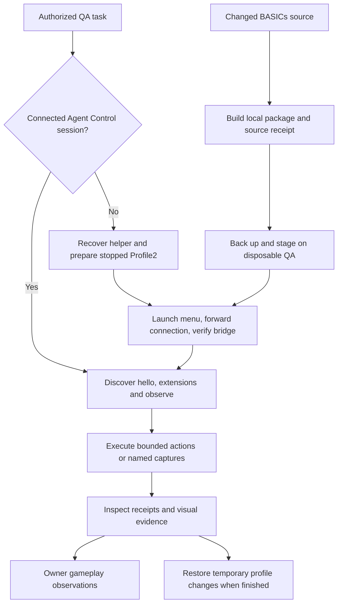

# Repeatable Vintage Story client workflow

Run from this repository's root on Windows. Use PowerShell 7 for profile, capture and build scripts; the QA staging script uses Windows PowerShell for the installed WinSCP .NET Framework assembly. The game installation must provide Vintage Story 1.22.7 and the build needs .NET 10. Clips additionally need FFmpeg and FFprobe. Profile2 must already exist and be signed into its disposable test account, with the server's `root` privilege for wizard captures.

Resolve paths from `AGENTS.local.md` or the current operator's setup. The examples below use the established machine layout. Do not copy account credentials, game binaries, downloaded mods or generated media into Git. Keep a new directory per operation, including failures, so its backup and receipt survive retries.



## Recover and launch Profile2

The tracked [startup/cancellation patch](../../../../docs/agent-context/2026-10-06-profile2-startup.patch) applies to Git snapshot `ffab5508d10153f0dce3fe0073a94b9172d3a568` in the same Vintage-Story-Mods repository. The recovery script archives that snapshot into a fresh directory, initializes an isolated Git context and applies the patch there. It leaves the source checkout unchanged. A second Agent Control repository is not required if this checkout has the pinned object. The recovered runbook's sample-extension install and acceptance section is optional; this workflow uses the BASICs wizard extension and does not require `agentcontrol.sample`.

```powershell
$repo = (Get-Location).Path
$profile = 'D:\Games\VSProfiles\Profile2'
$game = 'D:\Games\Vintagestory'
$dotnet = 'D:\bench\vs\.dotnet\dotnet.exe' # or an installed .NET 10 dotnet
$run = Join-Path $repo ('.tmp/agent-qa-' + [Guid]::NewGuid().ToString('N'))
New-Item -ItemType Directory -Path $run | Out-Null

# Read-only discovery. If absent, fetch this exact snapshot from the expected origin.
git cat-file -e 'ffab5508d10153f0dce3fe0073a94b9172d3a568^{commit}'
if ($LASTEXITCODE -ne 0) { git fetch origin ffab5508d10153f0dce3fe0073a94b9172d3a568 }
if ($LASTEXITCODE -ne 0) { throw 'The pinned controller snapshot is unavailable.' }

# BuildOnly reconstructs, tests, packages and publishes, without editing Profile2.
./scripts/prepare-vs-agent-profile.ps1 -AgentControlSource $repo -DataPath $profile `
    -GameInstall $game -DotNetPath $dotnet -OutputRoot (Join-Path $run 'build-probe') -BuildOnly

# Provision the stopped disposable profile after the local checks pass.
./scripts/prepare-vs-agent-profile.ps1 -AgentControlSource $repo -DataPath $profile `
    -GameInstall $game -DotNetPath $dotnet -OutputRoot (Join-Path $run 'profile')
```

Preparation backs up existing helper zips and `ModConfig/agentcontrol.json`, preserves unknown config fields, removes duplicate helper versions, and verifies installed hashes. It sets the Profile2 pipe to `vintage-story-agentcontrol-profile2`, enables startup once after player readiness, retains the mutation grant, and uses the tested action/batch limits of 30/60 seconds. Follow the emitted preparation receipt for the recovered CLI path and restoration.

```powershell
$vsctl = Join-Path $run 'profile/vsctl/vsctl.exe'
./scripts/start-vs-agent-client.ps1 -DataPath $profile -GameInstall $game `
    -VsCtlPath $vsctl -ServerAddress '15.235.75.126:30000' `
    -OutputRoot (Join-Path $run 'launch') -ShowWindow
```

The launcher refuses other running clients because Vintage Story uses a global connection-forwarding pipe. It starts the menu without `-c`, waits for current-process menu readiness, forwards the connection, then waits for an enabled protocol-1.0 bridge and a connected observation. Every wait is bounded and the launch receipt identifies the process it owns. Use `-RestartOwnedClient` only when a restart is authorized; it checks exact profile, executable and process identity before stopping that client. Omit `-ServerAddress` to stop at the menu. Ordinary unattended launches keep the window hidden; use `-ShowWindow` for the owner's visible test session.

## Build and stage The BASICs

The canonical build now has `-LocalOnly`, which skips dotenv loading, profile deployment and SFTP upload. Its optional build receipt binds the package hash to the supplied GUI source stamp. Test builds can overwrite a stamped package, so package after tests and stage the exact recorded bytes.

```powershell
$env:VINTAGE_STORY = $game
$env:DOTNET_EXE = $dotnet
$sourceHash = ./scripts/gui-source-identity.ps1
$buildReceipt = Join-Path $run 'build.json'
./mods-dll/thebasics/scripts/build-and-package.ps1 -LocalOnly `
    -SourceTreeHash $sourceHash -ReceiptPath $buildReceipt
$built = Get-Content -Raw -LiteralPath $buildReceipt | ConvertFrom-Json
```

QA staging accepts only the established `pt.basicbit.net` server `8982de16`. Supply credential source paths explicitly, or use the existing process variables. `PTERO_TOKEN` must be a Client API token (`ptlc_`), and SFTP requires the configured host-key fingerprint. The paths come from local operator context; secret values never belong in command arguments, copied dotenv files or receipts.

```powershell
# Run this invocation in Windows PowerShell. Assign these paths in that process too.
./scripts/stage-vs-qa-package.ps1 -Package $built.Package -ExpectedSha256 $built.Sha256 `
    -ExpectedSourceTreeHash $built.SourceTreeHash -BuildReceipt $buildReceipt `
    -ClientDataPaths @($profile, 'D:\Games\VSProfiles\Profile3') `
    -CredentialFiles @('<local root dotenv path>', '<local mod dotenv path>') `
    -OutputDirectory (Join-Path $run 'stage') -Restart
```

Staging verifies the compiled DLL's stamp without executing the mod. It backs up current server packages, config and main log, plus the explicit client packages, before replacing anything. Uploaded bytes and client packages must match the build hash. `-Restart` is opt-in and waits for fresh boot evidence. Client launch is a separate step. On failure, keep `backup-index.json`, the journal and stage receipt; the generated `RESTORE.md` maps the exact local and remote recovery files. Do not retry an uncertain write without inspecting that journal.

## Capture and review

For a connected enabled session, first inspect the current capabilities:

```powershell
& $vsctl hello --pipe vintage-story-agentcontrol-profile2
& $vsctl extensions --pipe vintage-story-agentcontrol-profile2
& $vsctl observe --pipe vintage-story-agentcontrol-profile2
```

The native runner discovers the three wizard operations, opens a server-authorized capture-only dialog, queues a named scene, and polls its job. It checks the fixed profile capture directory, source identity and native coverage before copying images. Omitting `-Scenarios` captures all 16 scenes. Outputs include action receipts, per-image provenance and `captures.json` with profile and pipe identity.

```powershell
$sourceHash = ./scripts/gui-source-identity.ps1
./scripts/capture-native-wizard.ps1 -ExpectedSourceTreeHash $sourceHash `
    -Vsctl $vsctl -DataPath $profile -Scenarios wizard-hub,wizard-chat-default `
    -OutputDirectory (Join-Path $run 'native')

./scripts/capture-native-wizard-clip.ps1 -ExpectedSourceTreeHash $sourceHash `
    -Vsctl $vsctl -DataPath $profile -Scenario wizard-hub `
    -DurationSeconds 2 -SamplesPerSecond 4 -OutputDirectory (Join-Path $run 'clip')
```

The clip uses the full viewport, pads odd dimensions for H.264, and validates the same source/profile/environment across poses. FFprobe verifies frame count, dimensions and duration. `clip.json` preserves each image and manifest hash plus the video hash. It is a sequence of named poses, not a real-time screen recording. Keep a fresh enabled session for each sequence near the controller's 32-job capture limit; completed jobs still count in that session.

If the installed package has a different source stamp, return to local build, explicit QA staging and client relaunch. Capture discovery and `hello` cannot establish that the current GUI source is loaded.

For GUI-scale probes, close the owned client through an authorized action, then edit only the numeric scale value. The script preserves all other JSON bytes and the UTF-8 BOM, backs up the original, and refuses running or ambiguous profiles. Launch and capture at each scale using the same commands above.

```powershell
./scripts/start-vs-agent-client.ps1 -DataPath $profile -GameInstall $game `
    -OutputRoot (Join-Path $run 'stop-before-scales') -StopOnly
foreach ($scale in @('1', '1.25')) {
    ./scripts/set-vs-agent-scale.ps1 -DataPath $profile -Scale ([double]$scale) `
        -OutputDirectory (Join-Path $run "scale-$scale")
    ./scripts/start-vs-agent-client.ps1 -DataPath $profile -GameInstall $game `
        -VsCtlPath $vsctl -ServerAddress '15.235.75.126:30000' `
        -OutputRoot (Join-Path $run "launch-scale-$scale") -ShowWindow
    ./scripts/capture-native-wizard.ps1 -ExpectedSourceTreeHash $sourceHash `
        -Vsctl $vsctl -DataPath $profile -Scenarios wizard-hub,wizard-chat-default `
        -OutputDirectory (Join-Path $run "native-scale-$scale")
    ./scripts/start-vs-agent-client.ps1 -DataPath $profile -GameInstall $game `
        -OutputRoot (Join-Path $run "stop-scale-$scale") -StopOnly
}
# Inspect each native manifest's actual scale. Restore the initial scale, preserving game writes.
$firstScale = Get-Content -Raw -LiteralPath (Join-Path $run 'scale-1/scale-receipt.json') | ConvertFrom-Json
./scripts/set-vs-agent-scale.ps1 -DataPath $profile -Scale $firstScale.guiScaleBefore `
    -OutputDirectory (Join-Path $run 'restore-original-scale')
```

For standalone layout renders and sticky PR differences, use [GuiPreview](../../../../tools/GuiPreview/README.md), `scripts/collect-gui-captures.ps1`, and the tracked `GUI Captures` / `GUI Capture Report` workflows. These omit native Pip and world rendering. The generated PR base is separate from a human-approved screenshot baseline.

For optional model review of the clip, follow the tracked [video rubric and adapter reproduction](../../../../docs/agent-context/2026-10-06-wizard-video-rubric.md). It pins the original review helper and applies the saved adapter patch in a disposable directory. Verify the original helper hash and current provider/model availability before an authorized paid call. Do not convert a model's visual assessment into human acceptance or baseline approval.

## Restore and handoff

Stop the owned client with the launcher's `-StopOnly` before restoration. `vsctl shutdown` disables the controller session and leaves the game running. The two-scale loop above already restores its initial scale, so skip the scale receipt command on that path. For a standalone 1.25 probe whose settings still match its output, use its receipt; then restore the helper:

```powershell
./scripts/set-vs-agent-scale.ps1 -DataPath $profile `
    -RestoreReceipt (Join-Path $run 'scale-1.25/scale-receipt.json')
./scripts/prepare-vs-agent-profile.ps1 -DataPath $profile `
    -RestoreReceipt (Join-Path $run 'profile/profile-receipt.json')
```

A scale receipt restores whole original bytes only if the settings still match its recorded output (or are already restored). If the client rewrote settings meanwhile, make a fresh scale-only edit back to the recorded original value; do not replace unrelated settings. A preparation receipt likewise rejects changed touched files. For partial staging failures, use the generated recovery mapping and journal before relaunching.

The handoff must link the run directory, package/build identity, preparation/staging/launch receipts, native capture manifests, optional clip/review, restoration state and remaining human cards. Record what was actually observed. The automated capture path does not complete invitation, live save/restart, player-state isolation or gesture-feel QA.

## Local checks

```powershell
./scripts/test-vs-local-package.ps1
./scripts/test-vs-agent-profile.ps1 -AgentControlSource $repo
./scripts/test-vs-agent-visuals.ps1
# Windows PowerShell:
./scripts/test-vs-qa-package.ps1
./scripts/check-agent-tooling.ps1
```

These use disposable fixtures and mocked game/server boundaries. The profile recovery `-BuildOnly` probe above additionally exercises the actual pinned patch, .NET tests, packaging and CLI publish, without game-profile or server writes. A fresh live capture is separate evidence.
