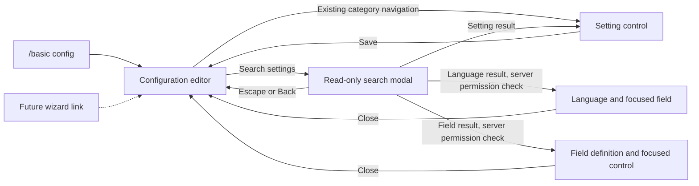

# Config search, local implementation and QA

Owner: this chat. Worktree: `.codex-worktrees/general-proximity-cleanup`, branch `codex/general-proximity-cleanup`.

Scope: a separate read-only search modal in `/basic config`, native editor navigation, current settings draft values, language definitions, character-sheet field definitions, and scrollable settings. No player character-sheet answers are indexed. General chat removal or renaming remains a separate undecided request.

## Journey

## Verification boundary

Native standalone previews use the installed 1.22.7 game API. Search matching, unsaved values, definition targets, query retention/clearing, draft preservation, focus and scrolling are checked locally. Preview composition is not calibrated against an in-game screenshot and does not prove the network roundtrip.

Local build/package succeeded. Package SHA256: `4EE85AC40AA77E694F1903FF28DC5B4C8434685B479A76FA1A5B19C21C0501F8`.
132 focused tests passed with no skips, including native production previews at GUI scales 1.0 and 1.25. Broad-query checks verify that a result list taller than 16,384 pixels creates no oversized textures. Scrolled previews verify that native widget backgrounds and labels move and clip together. Artifacts are in worktree `.tmp/search-tests/`; build/test logs are `.tmp/search-package.log` and `.tmp/search-validation.log`.

The implementation reuses vanilla JSON composition through private game API bindings; rerun native previews after game API upgrades. Compilation includes analyzer warnings and a NuGet vulnerability-feed warning caused by unavailable network access.

The earlier chat-tab QA build staged October 2 is separate. This implementation has not replaced packages on the test server or Profile2/Profile3, restarted the server, or relaunched clients. Do not interrupt the owner's ongoing chat-tab QA.

Read-only profile inspection on October 6 found both profiles now use SHA256 `CF4F92AFA75F7DE38741D3E640094FB44FCF43CF2DACB96725F79217E145D5A0`, which differs from the October 2 staging record. This chat did not write that package; do not assume the old staging record describes the current test environment.

## Human QA, one batch

Run after the search package is staged and the owner is ready. Use an admin account; restore any changed draft values before closing. All cards are pending human observations.

1. **Read-only search and navigation** (P1)
   - Config: any.
   - Do: `/basic config`, Search settings, type `proximity position`, then click Proximity tab position.
   - Expect: a read-only result shows category, current value and description. Search closes; Chat tabs opens with `>` beside the setting and its dropdown focused. Reopen Search: the query is selected, and Delete clears it.
   - Watch for: editable controls appearing in search, wrong category or control, query lost during navigation.

2. **Draft search and close behavior** (P0)
   - Config: any.
   - Do: change Proximity tab position without saving, search its JSON key plus the selected value. Return to the editor, open another category, reopen Search. Close Search with Escape. Close the config editor, cancel discard, reopen Search. Finally discard the draft, reopen `/basic config`, and open Search.
   - Expect: result shows the draft value and Unsaved. Category changes and canceled discard retain draft/query. Escape closes only Search. A genuine config-menu close clears the query.
   - Watch for: accidental save, dropped draft, stale query after closing and reopening the editor.

3. **Language and field destinations** (P1)
   - Config: at least two languages and two character-sheet field definitions; one field with an options list.
   - Do: search a distinctive language description or prefix, click that result, then close its editor. Search a distinctive option value in a character-sheet field definition and click it. Also search a published field's Id.
   - Expect: correct entry and exact control focused; saved Id stays locked and is marked with `>`. Closing either editor returns to config, with the search query retained. Main settings draft edits survive these roundtrips.
   - Watch for: wrong entry, stale field focus, lost main draft, unlocked saved Id, permission error leaving config inaccessible.

4. **Scrollable settings and keyboard access** (P1)
   - Config: any. Repeat at normal and enlarged GUI scale.
   - Do: open a long category, scroll to its last setting, then Tab through controls. Search `a`, scroll results to the bottom, and Tab through result titles.
   - Expect: settings labels and controls move together, content clips at panel edges, category/search navigation and Save stay visible. Keyboard focus scrolls into view; results remain readable and clickable at the bottom.
   - Watch for: labels left behind, footer overlap, blank results, missing final row, offscreen keyboard focus, clicks reaching the editor behind Search.

5. **Empty results** (P2)
   - Config: any.
   - Do: search `missing-setting-xyz`, then clear the query, then search again.
   - Expect: helpful no-match and empty-query messages; typing stays focused and results update without reopening the modal.
   - Watch for: focus crash, stale rows, stale scrollbar position.

Retire this packet after the implementation is integrated and these observations are recorded in the release/PR QA record. Manual QA is not complete until the owner approves completion.
