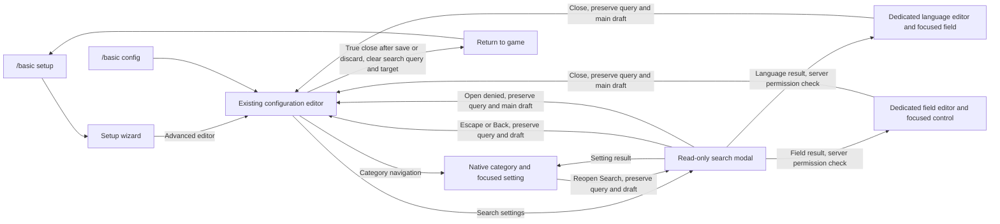

# Config search, local implementation and QA

Owner: BASIC's existing chat "Find proximity chat settings", thread `01a0fa70-8ca5-7321-ac1f-07fe824f5be2`, host `local`. Combined implementation worktree: `.codex-worktrees/visual-config-wizard`, branch `codex/visual-config-wizard`. Original search worktree: `.codex-worktrees/general-proximity-cleanup`, branch `codex/general-proximity-cleanup`.

## Ownership handoff, October 6

Source chat "Document proximity chat settings" (`01a0fa7a-30cd-7112-8f20-0edd0fcb11e3`) handed off overlapping implementation. Search is now integrated locally with the visual wizard in the receiving chat's worktree. That chat owns combined validation, staging, and remaining QA.

The original search implementation is committed as `53e86fc`; earlier General proximity cleanup, focus and tab placement are in `0c5aa0a`. Those source checkpoints and their validation below are historical evidence, separate from the combined staging receipt recorded below.

Expected next result: verify fresh native captures and run the combined human QA cards. All five human cards below remain pending. General removal or renaming is undecided. No merge or release authorization is implied by this handoff.

Scope: a separate read-only search modal in `/basic config`, native editor navigation, current settings draft values, language definitions, character-sheet field definitions, and scrollable settings. No player character-sheet answers are indexed. General chat removal or renaming remains a separate undecided request.

## Journey

## Verification boundary

The combined local suite passed 1,290 tests with no skips. The subsequent result-denial recovery passed all 62 affected checks, including two native GUI regressions. It restores the main config editor when a language or field open request receives a failed result message, preserving its query and draft and clearing navigation state. This does not prove an in-game network roundtrip.

The canonical combined package has been staged on QA server `8982de16` and Profile2/Profile3, with matching readback SHA-256 `59a59e0bbd1a6e5646502825007d0155bbac6cdfa7ae573a0287f525704fb699`. Source identity is `3ab79de9d2d8fb83bff5e4151a5edd05a47fed6f3a5a5a938195407c65bbadc4`. Build: zero errors, 141 warnings. The server reached RunGame at 23:59:10 UTC; `.tmp/wizard-native-combined-set` holds 13 source-verified native wizard scenes at GUI scale 1.125. In-game search and all human cards remain pending. Combined standalone search artifacts are in `.tmp/combined-search-tests` and `.tmp/combined-search-denial-tests`.

`ProximityChatTabPosition` uses `ProtoMember(159)`. The existing `CharacterSheetAutoOpenOnCharacterScreen` remains at `ProtoMember(158)`; integration does not renumber it.

### Historical source-only validation

Native standalone previews in the original search worktree used the installed 1.22.7 game API. Search matching, unsaved values, definition targets, query retention/clearing, draft preservation, focus and scrolling were checked locally. Preview composition was not calibrated against an in-game screenshot and did not prove the network roundtrip.

The source-only local build/package succeeded. Historical package SHA256: `4EE85AC40AA77E694F1903FF28DC5B4C8434685B479A76FA1A5B19C21C0501F8`.
132 focused tests passed with no skips, including native production previews at GUI scales 1.0 and 1.25. Broad-query checks verify that a result list taller than 16,384 pixels creates no oversized textures. Scrolled previews verify that native widget backgrounds and labels move and clip together. Artifacts are in worktree `.tmp/search-tests/`; build/test logs are `.tmp/search-package.log` and `.tmp/search-validation.log`.

The implementation reuses vanilla JSON composition through private game API bindings; rerun native previews after game API upgrades. Compilation includes analyzer warnings and a NuGet vulnerability-feed warning caused by unavailable network access.

Earlier chat-tab and wizard packages are separate evidence. Their screenshots, hashes, restarts, and client launches do not validate this combined search/wizard source. The combined package receipt is `.tmp/wizard-qa-stage-receipt.json`; record its fresh native captures separately.

## Human QA, one batch

Run after the combined package is staged and the owner is ready. Use an admin account; restore any changed draft values before closing. All five cards are pending human observations.

1. **Read-only search and navigation** (P1)
   - Config: any.
   - Do: `/basic setup`, Advanced editor, Search settings, type `proximity position`, then click Proximity tab position. Also verify direct entry with `/basic config`.
   - Expect: a read-only result shows category, current value and description. Search closes; Chat tabs opens with `>` beside the setting and its dropdown focused. Reopen Search: the query is selected, and Delete clears it.
   - Watch for: editable controls appearing in search, wrong category or control, query lost during navigation.

2. **Draft search and close behavior** (P0)
   - Config: any.
   - Do: change Proximity tab position without saving, search its JSON key plus the selected value. Return to the editor, open another category, reopen Search. Close Search with Escape. Close the config editor, cancel discard, reopen Search. Finally discard the draft, reopen `/basic config`, and open Search.
   - Expect: result shows the draft value and Unsaved. Category changes and canceled discard retain draft/query. Escape closes only Search. A genuine config-menu close clears the query.
   - Watch for: accidental save, dropped draft, stale query after closing and reopening the editor.

3. **Language and field destinations** (P1)
   - Config: at least two languages and two character-sheet field definitions; one field with an options list.
   - Do: search a distinctive language description or prefix, click that result, then close its editor. Search a distinctive option value in a character-sheet field definition and click it. Also search a published field's Id.
   - Expect: correct entry and exact control focused; saved Id stays locked and is marked with `>`. Closing either editor returns to config, with the search query retained. Main settings draft edits survive these roundtrips. A denied open request reports the error and returns to config with the query and main draft retained, including denial delivered as a result message.
   - Watch for: wrong entry, stale field focus, lost main draft, unlocked saved Id, permission error leaving config inaccessible.

4. **Scrollable settings and keyboard access** (P1)
   - Config: any. Repeat at normal and enlarged GUI scale.
   - Do: open a long category, scroll to its last setting, then Tab through controls. Search `a`, scroll results to the bottom, and Tab through result titles.
   - Expect: settings labels and controls move together, content clips at panel edges, category/search navigation and Save stay visible. Keyboard focus scrolls into view; results remain readable and clickable at the bottom.
   - Watch for: labels left behind, footer overlap, blank results, missing final row, offscreen keyboard focus, clicks reaching the editor behind Search.

5. **Empty results** (P2)
   - Config: any.
   - Do: search `missing-setting-xyz`, then clear the query, then search again.
   - Expect: helpful no-match and empty-query messages; typing stays focused and results update without reopening the modal.
   - Watch for: focus crash, stale rows, stale scrollbar position.

Retire this packet after the implementation is integrated and these observations are recorded in the release/PR QA record. Manual QA is not complete until the owner approves completion.
