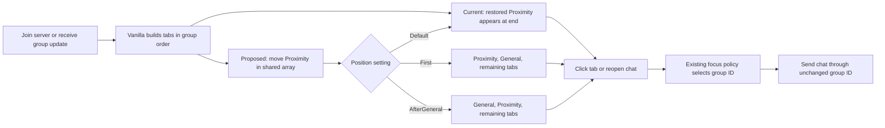

# Proximity chat tab placement research

Research date: October 1, 2026. Scope: local Vintage Story 1.22.6 decompilation, current The BASICs client patches, and official API documentation/source. No implementation or test-server changes were made for this research.

## Recommendation

Client-side placement is viable at the source level. Add one setting, `ProximityChatTabPosition`, with `GameOrder`, `First`, and `AfterGeneral`. Keep `GameOrder` as the serialization/compatibility default for existing configurations; recommend `AfterGeneral` for operators who want conversation ahead of logs. Move only Proximity, preserving the relative order of every other tab. `AfterGeneral` puts Proximity before Damage Log, Info Log, and Server Info in the normal vanilla order. Use the actual General group ID as the anchor, never a translated name or hard-coded visual index. An optional `AfterSystemTabs` choice would put Proximity after the four known vanilla tabs; add it only if that placement is actually wanted, because it does not resolve arbitrary mod-added tab ordering.

Do not remove and recreate player-group memberships to change presentation. Tab placement should not change membership, group UIDs, history, or server permissions. When General is used for proximity, or the Proximity group is missing, the setting has no effect. This is placement in the tab order, not a permanently visible tab outside the horizontal scrolling area.

## Verified local source facts

- `HudDialogChat.ComposeChatGuis` creates its private `GuiTab[] tabs` from `OwnPlayerGroupsById` iteration order, with each group's ID in `DataInt`, then passes that same array to `AddHorizontalTabs`. [HUD composition](D:/bench/vs/source/vintagestory/1.22.6/decompiled/VintagestoryLib/Vintagestory/Client/NoObf/HudDialogChat.cs:188).
- The horizontal widget retains the passed array reference. Its widths, offsets, base texture, selected overlays, and unread overlays depend on the order during composition. Replacing or rearranging only the widget's array after rendering is insufficient. [Widget constructor](D:/bench/vs/source/vintagestory/1.22.6/decompiled/VintagestoryAPI/Vintagestory/API/Client/GuiElementHorizontalTabs.cs:60), [texture composition](D:/bench/vs/source/vintagestory/1.22.6/decompiled/VintagestoryAPI/Vintagestory/API/Client/GuiElementHorizontalTabs.cs:99).
- Clicking calls the handler with `tabs[selectedIndex].DataInt`. The HUD's `tabIndexByGroupId` scans its private array. Incoming-message alarms and automatic selection use that lookup; goto-group packets scan the widget array. Both arrays must agree. [SetValue](D:/bench/vs/source/vintagestory/1.22.6/decompiled/VintagestoryAPI/Vintagestory/API/Client/GuiElementHorizontalTabs.cs:349), [HUD lookup](D:/bench/vs/source/vintagestory/1.22.6/decompiled/VintagestoryLib/Vintagestory/Client/NoObf/HudDialogChat.cs:605), [goto-group](D:/bench/vs/source/vintagestory/1.22.6/decompiled/VintagestoryLib/Vintagestory/Client/NoObf/HudDialogChat.cs:746).
- Full and individual group packets rebuild the HUD. Full packets seed General, Damage Log, Info Log, and optionally Server Info before adding server groups. Every rebuild clears composers, creates fresh alarm arrays, and unfocuses elements. The widget initially selects index zero independently of `game.currentGroupid`. [Packet handling](D:/bench/vs/source/vintagestory/1.22.6/decompiled/VintagestoryLib/Vintagestory/Client/NoObf/HudDialogChat.cs:770).
- `GuiComposer.DialogName` is public. `AddHorizontalTabs` creates the widget only when the composer is not composed. `GuiComposer.ReCompose()` reuses existing elements and calls `Compose(focusFirstElement: false)`. It does not itself clear composers or focus the first element. [Composer fields](D:/bench/vs/source/vintagestory/1.22.6/decompiled/VintagestoryAPI/Vintagestory/API/Client/GuiComposer.cs:34), [helper](D:/bench/vs/source/vintagestory/1.22.6/decompiled/VintagestoryAPI/Vintagestory/API/Client/GuiComposerHelpers.cs:213), [ReCompose](D:/bench/vs/source/vintagestory/1.22.6/decompiled/VintagestoryAPI/Vintagestory/API/Client/GuiComposer.cs:290).
- Existing The BASICs focus patches operate by group ID. Opening chat chooses remembered group, then configured Proximity, then General; the remembered-group branch currently does not fall back if that group no longer exists. Position should remain independent of these focus choices. [Current focus patch](D:/bench/vs/Vintage-Story-Mods/.codex-worktrees/general-proximity-cleanup/mods-dll/thebasics/src/ModSystems/ChatUiSystem/ChatUiSystem.cs:2275). Config and Proximity ID arrive separately from vanilla HUD composition. [Config receipt](D:/bench/vs/Vintage-Story-Mods/.codex-worktrees/general-proximity-cleanup/mods-dll/thebasics/src/ModSystems/ChatUiSystem/ChatUiSystem.cs:1952).

## Proposed smallest implementation

1. Prefix `GuiComposerHelpers.AddHorizontalTabs`, narrowly restricted to `composer.DialogName == "chatdialog"`, `key == "tabs"`, `!composer.Composed`, and callback target `HudDialogChat`. Verify reference equality with the owning HUD's private `tabs`. Move the Proximity entry **in place** before widget construction. A stable remove-and-insert operation preserves every other entry's order. Do not replace the argument array, because the HUD would retain the old reference.
2. After `ComposeChatGuis`, restore the visual selection for `game.currentGroupid` using the newly ordered array and `SetValue(index, callhandler: false)`. This avoids chat-open preference side effects, sound, and unnecessary selected-channel network packets. Do not call the existing `OnGuiOpened` preference patch for a cosmetic rebuild.
3. When config arrives after the widget already exists, verify shared-array identity, capture unread flags keyed by group ID, move the existing array in place, remap flags, recompose only the `chat` composer, and restore visual selection without invoking the handler. This preserves existing input objects instead of invoking a full HUD rebuild solely for placement.
4. If any expected structure is absent, leave vanilla order intact and log a bounded diagnostic. Skip identical desired order. Use the received Proximity ID, never its display name.

For unavoidable vanilla full rebuilds, a `ComposeChatGuis` prefix/postfix can capture and restore unread flags, chat draft/caret, and focused element by group identity where relevant. That is separate from the late-config recompose path. The cosmetic feature must not change message routing or steal focus. Preserve surviving groups' alarms; discard removed groups' state.

## Official corroboration and evidence limits

The [official API reference](https://apidocs.vintagestory.at/api/Vintagestory.API.Client.GuiElementHorizontalTabs.html) documents public `tabs`, `activeElement`, `TabHasAlarm`, and `SetValue(int, bool)`. The [official API source](https://github.com/anegostudios/vsapi/blob/master/Client/UI/Elements/Impl/Interactive/Controls/GuiElementHorizontalTabs.cs) corroborates array storage and ID-based callback dispatch. The [official helper reference](https://apidocs.vintagestory.at/api/Vintagestory.API.Client.GuiComposerHelpers.html) documents `AddHorizontalTabs` and `GetHorizontalTabs`. These online sources track current API development; the version-specific claims above come from the locally decompiled 1.22.6 assemblies.

Compatibility with claim/xlib or any mod that injects, clones, replaces, or independently sorts chat tabs is **unverified**. Keeping all other entries and IDs is compatible in principle, but patch ordering and live rebuilding require QA. Draft/caret retention, focus, unread alarms, narrow-window scrolling, keyboard navigation, config-before/after-group packet races, and reconnect behavior are also unverified in runtime.

## Current and proposed flow

No generic tab manager, drag-and-drop sorting, per-mod priority map, or extra focus modes is needed for the reported problem. Whether the server sets placement for everyone or players can override it locally was an unresolved product choice during research; the accepted implementation uses a server setting. A personal override can reuse the same three values without expanding server-side group management.

## Configuration presentation proposal

Group the related controls under **Chat tabs**, with placement and focus explained
separately. Keep existing JSON keys compatible.

| Control | Backing setting | Purpose |
| --- | --- | --- |
| Proximity tab position | New `ProximityChatTabPosition` | Game order, First, or After General. |
| Open Proximity by default | Existing `ProximityChatAsDefault` | Choose the opening channel when no remembered selection takes precedence. |
| Remember my selected tab | Existing `PreserveDefaultChatChoice` | Restore a valid saved selection instead of the default channel. |
| Keep Proximity selected when messages arrive | Existing `PreventProximityChannelSwitching` | Prevent automatic switching while the player is in proximity chat; manual selection remains possible. |
| Use General for proximity chat | Existing `UseGeneralChannelAsProximityChat` | Replace the separate channel; disable the separate-tab placement control in this mode. |

Recommend After General for the chosen new setup because the conversation tabs
remain adjacent and precede logs. First supports servers whose primary chat is
Proximity. Leave Game order available for compatibility. Personal overrides should
include **Use server default** so a player can return to the operator's policy.
The accepted implementation uses one server setting, `ProximityChatTabPosition`,
with a legacy default of `GameOrder`. Personal overrides remain a possible future
addition. The HUD composition postfix caches vanilla order, moves the shared tab
array, remaps alarms by group ID, and recomposes the existing composer only when
order changes. Vanilla unread textures are refreshed separately after recomposition.
Config receipts use the same path, preserving the current group.
This keeps the patch local to the HUD instead of patching every horizontal-tabs
helper call. Runtime rendering and compatibility still require the QA cards.

Moses's follow-up reports General mode opening an old Proximity selection. General
mode now always opens General, matching its existing decision not to persist new
tab choices. Separate-channel mode uses a valid remembered group, otherwise a
valid configured Proximity default, otherwise General. Regression checks cover
both paths without adding another focus option.
