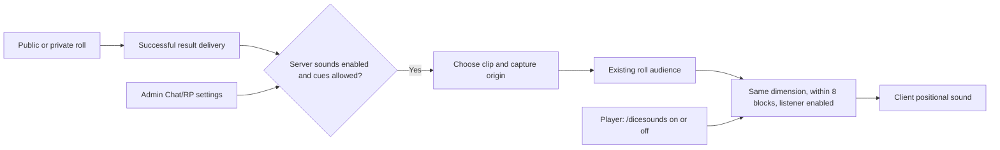

# Dice roll sounds implementation plan

> **For agentic workers:** REQUIRED SUB-SKILL: Use superpowers:subagent-driven-development or superpowers:executing-plans to implement this plan task-by-task. Steps use checkbox syntax for tracking. Prefer sequential execution because these tasks share registration and roll-delivery files.

**Goal:** Add Tagwin's nine dice recordings to successful rolls, with positional playback and independent server and listener controls.

**Architecture:** The server chooses one recording once per successful roll and sends a small sound packet only to eligible listeners from that roll's existing audience. The client plays that recording at the captured position using the game's normal sound-effects volume. Preferences live in server player Moddata and are independent of RP characters.

**Tech Stack:** C# / .NET 10, Vintage Story API, protobuf-net, xUnit v3, NSubstitute, PowerShell, FFmpeg.

**Spec:** The approved design is reproduced below. The owner accepted both decision rounds and the final design in this task on September 17, 2026. This document is the portable implementation handoff; no separate design file is required.

## Global constraints and approved design

- One random clip per successful roll, including multi-die rolls; repeats are allowed. Every listener receives the same choice.
- Play alongside the delivered result, without delaying chat or adding an animation. Capture the roller's position when the roll succeeds; do not follow a moving entity.
- Public audio has an initial 8-block radius with normal distance attenuation. Listeners must also belong to the existing roll recipient list and the same dimension.
- Private audio is self-only. Apply the existing spectator positional-cue suppression to all dice sound emission.
- `EnableDiceRollSounds` defaults to true, is live-editable in Chat/RP admin settings, and does not disable rolling itself.
- `/dicesounds on|off` sets the listener preference. `/dicesounds` reports status without toggling. Default true, persistent per player on that server across reconnects and character changes.
- A muted player still produces public sound for other eligible listeners. Server disable takes precedence without overwriting personal preferences.
- Use normal game sound-effects volume, fixed pitch, the existing roll rate limit, and no extra audio cooldown. Failed/help/disabled/rate-limited commands and historical results are silent.
- Balance recording levels and credit Tagwin. User reports that Tagwin recorded and offered these sounds for use. Do not invent a license grant or apply the code license to their recordings.
- Sound playback or packet failure must not invalidate an already-delivered roll or prevent other listeners from receiving their sound.
- Preserve existing protobuf member numbers. Use the next available number after inspecting the execution branch.
- No changes to dice evaluation, text, history, Discord relay semantics, bubble settings, or character projection. No new UI screen, volume slider, anti-repeat system, or generic audio framework.
- Repository manual-QA and merge approvals still apply. Writing this plan does not start manual QA or authorize a merge/release.



## Execution baseline and source evidence

The primary checkout has unrelated uncommitted work and does not currently contain the dice feature. Do not transplant the feature into that checkout or overwrite those edits.

- Inspected dice implementation: `D:\bench\vs\work\thebasics-dice-design`, clean at `b6b2428634d025c877e3b9f5214d54d65539816c` when planning.
- Start execution by checking the current branch, worktree, and upstream state. Use an isolated `codex/` worktree based on the current dice implementation, or current main if that implementation has since merged. Re-read applicable `AGENTS.md` and `AGENTS.local.md`. Do not assume the inspected head remains current.
- Source recordings: `C:\Users\steve\Downloads\diceroll1.ogg` through `diceroll9.ogg`. All nine are mono Vorbis, 48 kHz, 0.26 to 0.44 seconds. Preserve the originals.
- `DiceRollCommands.Handle` evaluates once; private delivery is self-only. `DeliverPublic` computes an explicit audience and then delivers chat, history, and the relay event. Reuse this audience rather than discovering players separately.
- Existing roll audience uses chat-mode Manhattan range; audio adds a Euclidean distance check without changing that text audience. Use strict `< 8` for the audio cutoff.
- `SpectatorChatPolicy.ShouldEmitEntityAttachedCues` is the existing policy to reuse.
- `ModConfig.EnableDiceRolling` has ProtoMember 155 at the inspected head. Number 156 is the candidate for this change, subject to rechecking all members on the execution branch.
- Existing chatter preferences are copied by `RpCharacterService`. Dice preferences must not enter those character snapshots.
- Network registration currently uses `_serverConfigChannel` in `RPProximityChatSystem` and `_clientConfigChannel` in `ChatUiSystem`. Append the new message at the same point in both registration sequences, preserving existing IDs/order.
- Locally inspected game API: `D:\bench\vs\source\vintagestory\1.22.6\decompiled`. `IWorldAccessor.PlaySoundAt` has a `SoundAttributes` overload with coordinates and dimension. Client entity playback supplies `Pos.InternalY`, not plain `Pos.Y`. Carry internal Y in the packet and explicitly reject a mismatched client dimension. Reconfirm against the actual execution target game API before coding.
- Game sound `Range` attenuates to 1% at the supplied distance. Enforce the strict recipient cutoff separately.

All code paths below are relative to the execution worktree. Test commands run from its root.

## File map

| File under `mods-dll/` | Responsibility |
|---|---|
| `thebasics/src/Configs/ModConfig.cs` | Server default and serialized setting |
| `thebasics/src/ModSystems/AdminConfig/ConfigAdminSettingRegistry.cs` | Live Chat/RP toggle |
| `thebasics/src/Extensions/IServerPlayerExtensions.cs` | Persistent listener getter/setter |
| `thebasics/src/ModSystems/DiceRolling/DiceRollCommands.cs` | Preference command and successful-roll integration |
| `thebasics/src/Models/DiceRollSoundMessage.cs` (new) | Clip and origin packet |
| `thebasics/src/ModSystems/DiceRolling/DiceRollSounds.cs` (new) | Small server delivery and client playback helper |
| `thebasics/src/ModSystems/ProximityChat/RPProximityChatSystem.cs` | Server packet registration and channel adapter |
| `thebasics/src/ModSystems/ChatUiSystem/ChatUiSystem.cs` | Client registration and handler adapter |
| `thebasics/assets/thebasics/sounds/dice/diceroll1.ogg` through `diceroll9.ogg` (new) | Balanced mono audio assets |
| `thebasics/assets/thebasics/lang/en.json` | Preference command text |
| `thebasics/README.md` | Feature, command, config, and Tagwin credit |
| `thebasics/docs/dice-sound-assets.md` (new) | Source hashes, processing, final measurements, credit |
| `thebasics.Tests/ModSystems/DiceRolling/DiceRollSoundTests.cs` (new) | Delivery, preference, packet, and playback behavior |
| Existing `DiceRollCommandsTests.cs`, `DicePublicDeliveryTests.cs`, `DiceCommandRegistrationTests.cs` | Integration and command regressions |
| Existing `Configs/ModConfigUpgradeTests.cs`, `ModSystems/AdminConfig/ConfigAdminSettingRegistryTests.cs` | Config defaults, round trip, and live setting |

## Task 1: Add the server and listener controls

**Interfaces produced:** `bool GetDiceRollSoundsEnabled(this IServerPlayer player)`, `void SetDiceRollSoundsEnabled(this IServerPlayer player, bool enabled)`, and `ModConfig.EnableDiceRollSounds`.

- [ ] Add a behavioral preference test using the existing `FakeServerPlayer` fixture:

```csharp
[Fact]
public void DiceMuteIsPerListenerAndDefaultsOn()
{
    var muted = new FakeServerPlayer("muted");
    var other = new FakeServerPlayer("other");
    Assert.True(muted.GetDiceRollSoundsEnabled());
    muted.SetDiceRollSoundsEnabled(false);
    Assert.False(muted.GetDiceRollSoundsEnabled());
    Assert.True(other.GetDiceRollSoundsEnabled());
    muted.SetDiceRollSoundsEnabled(true);
    Assert.True(muted.GetDiceRollSoundsEnabled());
}
```

- [ ] Run the targeted test and confirm failure is the missing feature:

```powershell
dotnet test mods-dll/thebasics.Tests/thebasics.Tests.csproj -c Release /p:SkipPostBuildPackage=true --filter FullyQualifiedName~DiceRollSoundTests
```

- [ ] Add the setting using the next free ProtoMember, and a `Bool` admin registry entry adjacent to `EnableDiceRolling`, category `Chat/RP`, label `Enable dice roll sounds`, `ConfigAdminReloadBehavior.Live`.
- [ ] Implement a new player Moddata key, following the repository key naming convention, with a one-byte boolean. No legacy migration is necessary for this new key:

```csharp
public static bool GetDiceRollSoundsEnabled(this IServerPlayer player)
{
    var data = player.GetModdata("thebasics-dice-roll-sounds-enabled");
    return data == null || data.Length != 1 || data[0] != 0;
}

public static void SetDiceRollSoundsEnabled(this IServerPlayer player, bool enabled)
    => player.SetModdata("thebasics-dice-roll-sounds-enabled", new[] { enabled ? (byte)1 : (byte)0 });
```

- [ ] Register `/thebasics dicesounds` unconditionally and `/dicesounds` only if unused, following the existing dice alias collision pattern. Use an optional boolean parser, require a player and `Privilege.chat`, and keep this command outside the roll attempt guard. Bare command reads status; an explicit boolean stores it. Permit saving a preference even while server sound is off.
- [ ] Add localized strings: description `Control whether you hear dice roll sounds.`, status `Your dice roll sounds are {0}.`, and server-off suffix `Dice roll sounds are disabled on this server.` Use existing localized on/off formatting.
- [ ] Extend registration/handler tests for bare status without mutation, on/off, invalid argument handling, collision-safe namespaced fallback, and changing preference while the server flag is off. Extend config tests for omitted JSON default true, explicit false round trip, and the live admin toggle changing the current config object.
- [ ] Verify persistence through the existing Moddata test fixture and character-switch path: changing characters must neither read nor write the dice key. Do not add the setting to `RpCharacterService` snapshots.
- [ ] Run the focused DiceRolling, ModConfigUpgradeTests, and ConfigAdminSettingRegistryTests filters. Commit this task's files only with `feat: add dice sound preferences`.

## Task 2: Package the recordings and attribution

**Consumes:** the nine source OGG files. **Produces:** nine stable asset names `thebasics:sounds/dice/diceroll1` through `diceroll9`.

- [ ] Record original SHA256 values and FFprobe metadata in `thebasics/docs/dice-sound-assets.md`. Include `Dice roll recordings by Tagwin, used with permission.` Keep source filenames and identify the owner's September 17 report as the permission provenance; do not fabricate a separate license.
- [ ] Create `assets/thebasics/sounds/dice`. Process from untouched source files once, keeping mono, 48 kHz, Vorbis. Initial gain targets mean volume -28 dB with decoded peak no higher than -1 dB. Based on measured originals, initial gains in clip order are `-1.5, -2.5, -0.5, -2.3, 1.3, -2.5, -0.9, 3.9, 2.4` dB. Re-measure first if source hashes changed.

```powershell
$gains = @(-1.5, -2.5, -0.5, -2.3, 1.3, -2.5, -0.9, 3.9, 2.4)
$destination = Join-Path (Get-Location) 'mods-dll/thebasics/assets/thebasics/sounds/dice'
New-Item -ItemType Directory -Force -Path $destination | Out-Null
for ($i = 1; $i -le 9; $i++) {
    $source = "C:/Users/steve/Downloads/diceroll$i.ogg"
    $output = Join-Path $destination "diceroll$i.ogg"
    $gain = $gains[$i - 1].ToString([Globalization.CultureInfo]::InvariantCulture)
    & ffmpeg -nostdin -n -v error -i $source -af "volume=${gain}dB" -ac 1 -ar 48000 -c:a libvorbis -q:a 5 $output
    if ($LASTEXITCODE -ne 0) { throw "Audio processing failed for diceroll$i" }
}
```

- [ ] Decode every output with `ffmpeg -v error -i <file> -f null NUL`, then inspect FFprobe metadata and `volumedetect`. Record output hashes, gains, durations, codec, channel count, and measured levels. Re-encode from the original with a lower gain if encoding overshoot breaches the peak target. Do not repeatedly transcode an output file.
- [ ] Add Tagwin's credit to the mod README. Preserve the transient character of the recordings; no compression, pitch randomization, looping, or added effects. Perceived consistency remains a manual listening check, not a claim derived from mean levels.
- [ ] Commit only audio, provenance, and credit with `feat: add Tagwin dice recordings`.

## Task 3: Dispatch one sound event per successful roll

**Consumes:** Task 1 preferences and Task 2 asset numbering.

**Interfaces produced:**

```csharp
// src/Models/DiceRollSoundMessage.cs; namespace thebasics.Models
[ProtoContract]
public sealed class DiceRollSoundMessage
{
    [ProtoMember(1)] public int Clip { get; set; }
    [ProtoMember(2)] public double X { get; set; }
    [ProtoMember(3)] public double InternalY { get; set; }
    [ProtoMember(4)] public double Z { get; set; }
    [ProtoMember(5)] public int Dimension { get; set; }
}

// src/ModSystems/DiceRolling/DiceRollSounds.cs
internal static void Deliver(ModConfig config, IServerPlayer roller,
    IReadOnlyList<IServerPlayer> audience,
    Action<DiceRollSoundMessage, IServerPlayer> send,
    Func<int> chooseClip);

// RPProximityChatSystem: thin internal adapter to its existing private channel
internal void SendDiceRollSound(DiceRollSoundMessage message, IServerPlayer recipient);
```

- [ ] Add tests against `Deliver` that capture sent packets through a delegate. Start with this meaningful listener test:

```csharp
[Fact]
public void MutedRollerStillMakesSoundForAnEnabledListener()
{
    var roller = new FakeServerPlayer("roller") { Entity = new EntityPlayer() };
    var listener = new FakeServerPlayer("listener") { Entity = new EntityPlayer() };
    listener.Entity.Pos.X = 2;
    roller.SetDiceRollSoundsEnabled(false);
    var heard = new List<string>();
    var choices = 0;
    DiceRollSounds.Deliver(new ModConfig(), roller, new IServerPlayer[] { roller, listener },
        (packet, target) => { Assert.Equal(4, packet.Clip); heard.Add(target.PlayerUID); },
        () => { choices++; return 4; });
    Assert.Equal(new[] { "listener" }, heard);
    Assert.Equal(1, choices);
}
```

- [ ] Run the DiceRollSoundTests filter and confirm the test fails before implementation.
- [ ] Implement `Deliver` in the new helper. Return for server disable, missing origin, or suppressed spectator cues. Snapshot coordinates, internal Y, and dimension once. Filter only the supplied audience using their preference, available entity position, same dimension, and squared distance `< 64`. Never consult `AllOnlinePlayers` here. Select a clip once for a nonempty eligible audience, using `Random.Shared.Next(1, 10)` supplied by the caller, independent of dice evaluation RNG.
- [ ] Build one packet and send to eligible listeners. Catch send failures per recipient so remaining recipients are attempted. The thin channel adapter must not broadcast. Use a fixed diagnostic message without private roll content if the existing logger is used.
- [ ] Append the packet type in both existing channel registration lists at matching positions. Add the server channel adapter shown above using `_serverConfigChannel?.SendPacket(message, recipient)`.
- [ ] Invoke delivery from `DiceRollCommands` after successful public result delivery using that exact `recipients` list; invoke after private text with `new[] { player }`. Keep invocation out of the evaluator and history replay. Isolate sound failures from `Handle`'s outer catch so a valid roll stays successful. Do not couple audio to `DicePresentation.Bubble` or its bubble-mode settings.
- [ ] Add tests for: server off; muted recipient; 7.9/8/8.1-block boundaries; diagonal Euclidean distance; recipient omitted from the text audience despite proximity; another dimension; active spectator; null entity; identical clip and coordinates across recipients; captured origin after sender movement; and one failing recipient followed by a successful recipient.
- [ ] Extend existing command integration tests to observe the actual packet send: public `3d6` emits once per eligible listener, private roll emits only to self, invalid/help/disabled/rate-limited attempts emit none, audio failure leaves command success and existing text/history/relay delivery intact. Use NSubstitute channel injection following existing chatter tests rather than replacing the command path with a test-only reimplementation.
- [ ] Run all DiceRolling tests and existing chatter tests. Commit with `feat: deliver scoped dice roll sound events`.

## Task 4: Play the sound on the client

**Consumes:** `DiceRollSoundMessage` and packaged asset names. **Produces:** `DiceRollSounds.Play(ICoreClientAPI api, DiceRollSoundMessage message)` called by the client handler.

- [ ] Write client-helper tests using a substituted `ICoreClientAPI`: valid clip calls playback once; clip 0 or 10 calls nothing; wrong dimension calls nothing; client more than or exactly 8 blocks from the captured origin calls nothing. Include nonzero-dimension/internal-Y coordinates and missing client player/entity during teardown.
- [ ] Run the focused tests and confirm failure, then implement the helper. Reject nonfinite coordinates before using them. Recheck distance against the client's current position because the player may have moved since dispatch. Build the exact asset path from integer clip 1 through 9, never from arbitrary packet text.
- [ ] Use the game's positional API with normal sound volume and no pitch randomization:

```csharp
var sound = new SoundAttributes(
    new AssetLocation("thebasics", $"sounds/dice/diceroll{message.Clip}"),
    withRandomPitch: false)
{
    Range = 8f,
    Type = EnumSoundType.Sound
};
api.World.PlaySoundAt(sound, message.X, message.InternalY, message.Z, message.Dimension);
```

- [ ] Register the client handler in `ChatUiSystem` and call the helper there. Do not add a second local playback path for the roller, a server world-sound broadcast, an entity-attached sound loop, or retained `ILoadedSound` objects. Missing assets/playback errors should leave chat functioning and return quietly from the handler, with at most a fixed diagnostic.
- [ ] Test the captured API call for exact origin, correct range, `EnumSoundType.Sound`, and fixed pitch. Verify packet serialization round-trips all five fields. Re-run dice and chatter tests, then commit with `feat: play positional dice sounds on clients`.

## Task 5: Integration, package verification, and QA handoff

- [ ] Update the README's dice documentation with the two controls, defaults, private behavior, per-server persistence, 8-block public range, and `/thebasics dicesounds` collision fallback. Server-off status must clearly explain that a personal on preference cannot override the server.
- [ ] Run the complete test project with the configured .NET 10 SDK and game dependencies:

```powershell
dotnet test mods-dll/thebasics.Tests/thebasics.Tests.csproj -c Release /p:SkipPostBuildPackage=true
```

- [ ] Run `./mods-dll/thebasics/scripts/build-and-package.ps1` from the isolated execution worktree. Before running, inspect its deployment hooks: use a worktree without copied `.env` credentials and set `THEBASICS_LOCAL_MOD_DIRS` to a staging directory inside that worktree. Confirm packaging will not upload or write to live game profiles during local validation. Do not modify or remove another checkout's credentials. The script intentionally cleans its local build directory; verify that resolved path remains inside the execution worktree.
- [ ] Open the produced ZIP and verify exactly nine expected dice audio entries and the newly built DLL, then extract/decode the packaged audio. Record package hash and test/build results. Do not infer successful game playback from the ZIP contents or unit tests.
- [ ] Review the diff for duplicate playback, accidental world broadcast, changes to existing protocol numbers/order, preference character-projection, or modifications outside this feature. Commit the remaining documentation/verification changes with `docs: document dice sound controls and validation`.
- [ ] Present the following manual cards and obtain explicit owner approval before preparing/starting in-game QA. Follow `.opencode/skills/human-qa/SKILL.md` for deployment, matching client ZIP hashes, and observed results. Do not mark QA complete without owner approval. Settings are live, so no extra restart is needed between config batches after the initial install.

### Batch A: Sounds enabled

1. **Public roll and positioning (P1)**
   - Config: server sounds on; both players `/dicesounds on`.
   - Do: Stand two blocks apart. Player A runs `/roll 3d6`. Player B turns to face away and A repeats after the normal rate-limit window.
   - Expect: One short sound per accepted command for both listeners, from A's direction, with the normal result immediately visible.
   - Watch for: Double playback for A, one sound per individual die, delayed result, sound following the wrong player.
2. **Range and text audience (P1)**
   - Config: same; normal chat range larger than eight blocks.
   - Do: Repeat rolls with B at 2, 6, and 9 blocks. Then choose a whisper range that excludes B while B remains within eight blocks and roll again.
   - Expect: Near sound is louder than far sound; no sound at nine blocks. No sound or result when excluded by the roll's text audience. Check through a wall within range: no extra line-of-sight rule is introduced.
   - Watch for: Sound beyond cutoff, chat mode increasing audio range, audio revealing rolls outside their audience.
3. **Private roll and listener mute (P1)**
   - Config: same; players two blocks apart.
   - Do: A runs `/proll d20`. B then runs `/dicesounds off`; both players make public rolls.
   - Expect: Only A hears/sees the private roll. With B muted, A still hears both public rolls, while B hears neither. Both still receive eligible public text.
   - Watch for: Private audio leaks or a muted roller becoming silent for everyone.
4. **Persistence and status (P1)**
   - Config: B remains muted.
   - Do: B checks `/dicesounds`, reconnects, switches RP characters through the existing character UI, and checks status after each. A rolls nearby after each step. Finally B uses `/dicesounds on`.
   - Expect: Status inspection never toggles. B remains muted until explicitly enabled; sound returns afterward.
   - Watch for: Preference reset on reconnect/character switch or a bare command changing it.
5. **Spectators, dimensions, bubbles, and history (P1)**
   - Config: sounds on.
   - Do: A rolls as an active spectator; then return to normal and test with B in another dimension. Test an ordinary nearby roll with bubbles off, then view its history.
   - Expect: Spectator roll emits no positional cue; another dimension receives no sound. Bubbles off does not mute ordinary rolls. Opening history does not replay sound.
   - Watch for: Position leaks, cross-dimension playback, audio coupled to bubble mode, replayed historical events.
6. **Clip consistency and game volume (P1)**
   - Config: sounds on, normal game effects volume.
   - Do: Audition all nine processed assets using the existing client audio/testing tools without adding a shipped audition command. Sample repeated real rolls at the same distance. Lower normal game sound-effects volume to zero, test again, then restore it.
   - Expect: Nine short clean impacts with comparable perceived loudness, no clipping or clicks from processing. The game effects control mutes them. Random rolls can repeat clips.
   - Watch for: A notably loud/quiet recording, music-volume routing, unintended pitch variation. Record any volume/range tuning and retest affected cards.

### Batch B: Server sounds disabled, then restored

7. **Live server override (P1)**
   - Config: disable `EnableDiceRollSounds` in Chat/RP while connected.
   - Do: With personal preferences on, test public and private rolls. Set B's preference off while the server is off. Re-enable the server setting live and roll again.
   - Expect: Results continue without sounds during disable. Commands explain the server override. On restoration, A hears sounds and B remains muted.
   - Watch for: Restart requirement, rolling disabled accidentally, preference overwritten, sounds continuing after the setting is applied.

## Completion evidence

Implementation completion requires focused/full automated results, successful package inspection, and a reviewed diff. In-game audio verification remains explicitly pending until the owner reports observations and approves QA completion. If later tasked with making a PR merge-ready, apply the repository's exact-head 30-minute review window and all feedback/check refresh requirements. This plan alone neither starts that loop nor authorizes merging or release.
