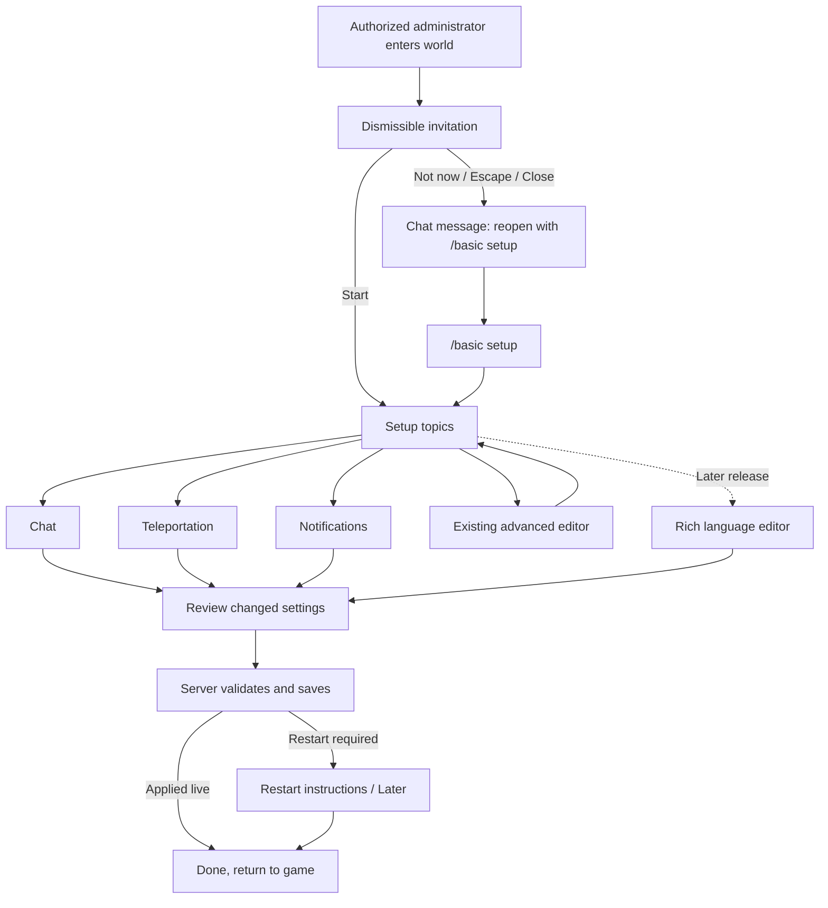

# Visual configuration wizard

Date: 2026-10-01. Agreed direction; implementation authorized by the owner's instruction to continue autonomously. Creative and real-game observation checkpoints remain.

## Outcome and agreed scope

An authorized administrator understands and configures chat, teleportation, and notifications through short explanations and previews of their current draft. Existing installations retain their current settings until an explicit successful save. The advanced configuration editor remains available.

The first visual scene is chat, using a temporary native character chosen from valid installed appearance and clothing options. The owner gets a creative checkpoint for the storyboard and each subsequent animation. Languages remain an enable choice in this release; their richer visual editor is a later branch.

First-run setup is offered through a dismissible invitation. Declining leaves a chat message containing `/basic setup`. A successful save prompts the administrator to restart when required, with host-appropriate instructions and a Later choice.

## Chosen approach

Extend the existing native config workflow and standalone GUI preview tool. Use native real-client rendering for the character, world-like scenes, actual notifications, and animation capture. Reuse the existing Agent Control extension seam for automated client capture.

Two alternatives were considered: prerecorded game clips are cheap to display but cannot faithfully reflect arbitrary draft choices; a general standalone 3D/game renderer would substantially delay a useful wizard. Use live native previews for parameter-sensitive examples and bounded 2D diagrams where they explain a setting more clearly.

## Page and action flow

Each topic returns to the hub. Back preserves edits. Review shows old and new values, with explicit live/restart status. Closing a dirty draft asks whether to discard it. Preview state is isolated from server config and player inventory.

## Invitation and access

- Reuse `Privilege.root` for `/basic setup`, invitation acknowledgement, opening, and saving. Do not trust a client-supplied player identity.
- Reuse `basic`, `tb`, and `thebasics` command aliases. Setup is player-only.
- Offer the automatic invitation once per administrator per world, using existing server-owned player mod data. Starting or intentionally dismissing acknowledges it. One administrator's dismissal does not suppress another's.
- Gate invitation on both client-ready and Playing. Try from both events, so their order does not lose the invitation. Clear ephemeral connection state on disconnect.
- Wait until no interactive dialog is open. Character creation and analytics consent take precedence; HUD objects do not block setup. Use main-thread callbacks and actual dialog state, not a fixed startup delay.
- Invitation copy: `Configure chat, teleportation, and notifications?` Actions: `Start setup`, `Not now`.
- Escape and title-bar close mean Not now. A disconnect or programmatic disposal does not count as a decline.
- Exactly one message after intentional decline: `You can configure The BASICs later with /basic setup.`
- Existing servers receive the invitation with their current configuration. Reviewed keys are not evidence of a new installation or a substitute for dismissal state.

## Configuration choices

### Chat

Expose existing independent controls, without changing their meaning:

1. RP features: `DisableRPChat`, with an accurate explanation that proximity delivery remains.
2. Channel: ordinary global General plus separate Proximity, or General replaced by proximity chat (`UseGeneralChannelAsProximityChat`). Show both tab layouts and their delivery consequences.
3. Presentation: `StandardRoleplay`, `SimpleSpeech`, `PlainProximity`, `Prose`, using real formatted sample text. PlainProximity is `Name: message`; it is not a language or range disable switch.
4. Language enable and local/global OOC examples. Global OOC requires the existing RP gate. Sticky local OOC permission is distinct from explicit local OOC syntax.
5. Whisper/normal/yell ranges, distance obfuscation, and default/remembered tab behavior. Keep advanced knobs in the existing editor.

The hearing visual follows current integer-block Manhattan delivery, with strict distance < range. Show a diamond footprint on a level grid and a separate circular obfuscation guide. Exactly -1 is server-wide speech. Defaults remain whisper 5, normal 35, yell 90, with obfuscation onset 2, 15, 45.

No complete vanilla-chat master switch exists today. Do not reinterpret DisableRPChat or silently add that gameplay behavior as part of this wizard. Per-player `/rptext off` bypasses chat-tab filtering; examples and copy must not claim delivery is universally enforced despite this existing opt-out.

### Teleportation

Six independently selectable BASICs tools: player requests, homes, spawn, top, back, stuck. Reuse `AllowPlayerTpa` and `Teleportation.Register*` keys. Registration is restart-shaped. Wording makes clear these settings control BASICs commands, not commands supplied by other mods.

Reveal existing cost, warmup, cooldown, home limit, privilege, and emergency-policy settings for selected tools. Preserve values belonging to untouched tools. No new master teleport config or speculative preset system.

The animation distinguishes request consent, stand-still warmup, payment, and arrival. TPA charges when submitting a request; home/top/back charge on successful completion. Label in-game hours, real minutes, and real seconds correctly. Stuck is gear-free and has separate staff-online restrictions and notices.

### Notifications

Save started and save finished each have Off / Chat / Popup plus editable text. Map these choices to the existing enable and notification-style flags. Turning off announcements does not disable saving or save pauses.

Sleep reminders have enable, percentage, and text. A four-person scene changes from one sleeper to two and shows the default reminder. This percentage does not alter night skipping. Existing 0% and 100% values do not trigger reminders; display their actual effect rather than silently modifying them.

## Draft, save, and restart behavior

Reuse the existing config registry, validation, persistence, live side effects, and broadcasting. Submit only changed keys, preserving unrelated concurrent administrator edits. Borrow `DialogDraftState` and `DialogRequestTracker` for draft preservation, request IDs, timeout recovery, and late responses.

For each changed key, submit its expected original value as well as its requested value. The server compares originals with its current canonical registry values before applying the patch. On conflict, report the affected keys and retain the draft. Do not add a global revision service solely for this wizard.

Capture restart-shaped registry values at server initialization. Compare saved values against this baseline to report all pending restart keys, including changes made by a previous save. A later change back to the startup value clears that pending key. The shared mutable Config object is not proof that startup-shaped commands or chat groups have changed.

Persist the detached validated draft before mutating shared runtime Config, applying side effects, or broadcasting. A persistence failure returns a correlated failure and leaves runtime config unchanged.

Only show the final success screen after the correlated server acknowledgement. A save failure or timeout retains edits and offers retry. Merge acknowledgements per key: replace values unchanged since submission with authoritative response values, preserve edits made since submission, and update their expected originals. Whole-snapshot retention must not turn unrelated concurrent changes into accidental edits.

When pending restart keys exist, finish with their names and appropriate instructions:

- Dedicated: `Restart the server from your hosting panel, or stop and start it using your normal launch method. Players must reconnect.`
- Integrated: `Save and quit to the main menu, then reopen this world.`
- Actions: `How to restart`, `Later`, `Back to setup`.

Vintage Story exposes graceful shutdown but no portable restart API. Do not label shutdown as Restart now, embed Pterodactyl credentials, or automatically restart on Save. A host-specific restart integration can be added separately if a supported capability is demonstrated.

## First visual experiment

One clipped production GUI panel contains a detached native seraph, nearby and distant listener indicators, and formatted sample chat. Use a valid temporary appearance/outfit fixture. Start with native idle and one greeting animation, then add the speech scene's explanatory beats.

Use an unregistered `EntityPlayerBot`, its private native gear inventory, and independently copied skin attributes. Deep-copy mutable entity properties/textures. Advance only its private animator with a fixed preview clock. Avoid world/entity simulation ticks, player UID inventory lookups, and server character-switch restore methods.

The public engine GUI rendering seams are verified; the detached animated character is not yet demonstrated on 1.22.7. Acceptance requires clipped appearance/clothing at two GUI scales, repeatable named-time frames, independence from the live player's animation, unchanged player appearance/inventory, and clean repeated open/close including a late mesh upload.

Standalone GuiPreview continues to fail on unsupported 3D operations. A separately named layout-only fixture may explicitly omit the native panel and record that omission. It cannot certify character or animation appearance.

## Capture and PR evidence

Extend existing Agent Control, not a second controller. Open the production dialog through its authorized path, set a named fixture/draft/preview time, and queue capture in the final render stage. Return a capture job ID and poll completion. Capture handlers run on game ticks, so they cannot synchronously assume the final framebuffer is ready.

Write PNGs only beneath a fixed capture directory and dispose returned bitmaps. Capture manifests contain game/mod/source identity, scenario, draft fixture, preview time, viewport, scale, locale, and coverage type. Generate animation clips from the same fixed-time native frames.

Reuse the existing Gemini video reviewer with a GUI-specific rubric and suitable sampling for short effects. Provider model/key/quota availability needs verification when running that stage. Ask for timestamped evidence. Automated model judgments assist review rather than silently approving baselines.

Reuse the existing sticky-comment upsert pattern. Show added/changed/removed/missing/stale screenshots with immutable before/after images and downloadable pixel-diff artifacts. Compare source-tree identity rather than requiring evidence-only commits to have the same commit SHA as their rendered code. Baselines are explicit reviewed inputs.

## Journey analytics

Use existing consent and actor attribution. Disabled consent sends no events. Server-level consent can report anonymous ordered setup runs; personalized consent may use the existing per-server actor pseudonym.

A server-issued wizard run ID, stable semantic step IDs, and sequence numbers cover invitation shown/dismissed/started, command entry, viewed steps, choices, back/skip, validation/conflicts/timeouts, save requests/results, and completion with pending-restart status. Never submit arbitrary message text, language syllables, notification wording, or unbounded option strings as analytics properties.

Analyze by wizard run, since PostHog distinct_id is the server install. A missing final event alone is not evidence of abandonment. A pending-restart completion is saved configuration, not a claim of activation. Use the next server startup/config snapshot as separate activation evidence instead of inventing a durable workflow coordinator.

Update producer, Worker allowlists, contract revision, and contract tests together. The verified local-main contract is revision 8; live deployment and hosted events are separate evidence.

## Implementation sequence

1. Native chat preview/capture feasibility probe and mascot fixture.
2. Guided dialog, invitation, chat branch, safe draft/save handling, and restart finish page.
3. Teleport and notification branches with their distinct storyboards and focused tests.
4. Journey instrumentation and PR screenshot reporting.
5. Real-client calibration, short clip review, and owner-observed gameplay QA.

Each increment leaves a runnable check and reviewable artifacts. Existing gameplay/config semantics remain stable. No merge or release is authorized by this design. Packaging/staging must follow the repository's established QA rules; human QA completion still needs the owner's observations.
