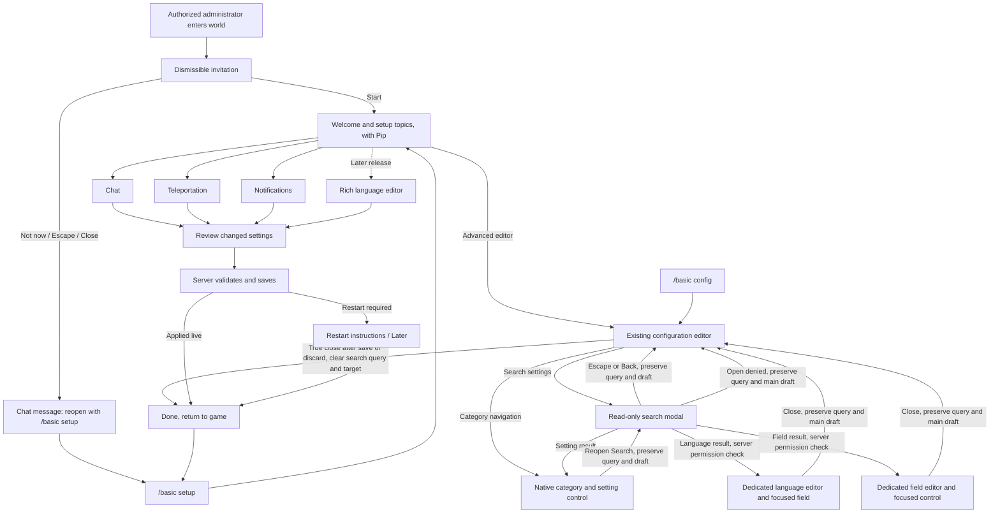
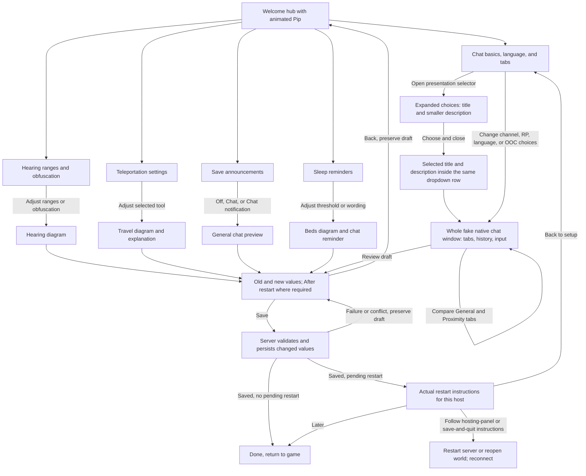

# Visual configuration wizard

Date: 2026-10-01. Agreed direction; implementation authorized by the owner's instruction to continue autonomously. Creative and real-game observation checkpoints remain.

October 6 integration checkpoint: the existing editor's read-only config search is integrated with the wizard and the combined package is staged on disposable QA. All five search human QA cards remain pending. Source-only search previews and earlier wizard captures are separate evidence. The result-denial recovery passed native GUI regression checks; in-game search remains unverified.

October 7 refinement, staged on disposable QA: each settings page uses the preview that explains its controls. The selected presentation title and description sit inside the closed dropdown. Pip appears on the welcome hub without a drag hint. Current source has 1316 passing tests, 32 valid CPU captures, and 16 native scenes plus wave/sleep probes. Owner observations remain pending; earlier combined-scene captures are separate evidence.

## Outcome and agreed scope

An authorized administrator understands and configures chat, teleportation, and notifications through short explanations and previews of their current draft. Existing installations retain their current settings until an explicit successful save. The advanced configuration editor remains available.

The first settings scene is chat, using a whole native mock chat window. A temporary native character chosen from valid installed appearance and clothing options welcomes administrators on the hub. The owner gets a creative checkpoint for the storyboard and each subsequent animation. Languages remain an enable choice in this release; their richer visual editor is a later branch.

First-run setup is offered through a dismissible invitation. Declining leaves a chat message containing `/basic setup`. A successful save prompts the administrator to restart when required, with host-appropriate instructions and a Later choice.

## Chosen approach

Extend the existing native config workflow and standalone GUI preview tool. Use native real-client rendering for the character, world-like scenes, actual notifications, and animation capture. Reuse the existing Agent Control extension seam for automated client capture.

Two alternatives were considered: prerecorded game clips are cheap to display but cannot faithfully reflect arbitrary draft choices; a general standalone 3D/game renderer would substantially delay a useful wizard. Use live native previews for parameter-sensitive examples and bounded 2D diagrams where they explain a setting more clearly.

## Page and action flow

Each topic returns to the hub. Back preserves edits. Native topic tabs provide consistent navigation between Topics, Chat, Teleportation, Notifications, and Review. Review shows old and new values and marks restart-shaped changes with `After restart`; ordinary settings pages omit restart labels. Closing a dirty draft asks whether to discard it and cancels any guide drag. Preview state is isolated from server config and player inventory.

The authorized contextual preview and save subflow is:

The earlier combined preview becomes these page-specific scenes. A future setting that controls an actual bubble or dialog can show that element above Pip. The richer language editor remains the longer-term direction, outside this increment.

Advanced editor suspends the wizard and opens the existing `/basic config` workflow. Its settings draft and search query survive category changes, closing Search, dedicated editor roundtrips, and canceled discard. A true config-menu close clears the search query and focus target. Reopen the suspended wizard with `/basic setup`; closing the advanced editor returns to the game. The wizard draft and advanced settings draft are separate. Search indexes setting values and definition metadata, not players' character-sheet answers. Rich visual language editing remains a later release.

The integrated tab-position setting uses `ProtoMember(159)`, preserving the existing `CharacterSheetAutoOpenOnCharacterScreen` field at `ProtoMember(158)`. Recovery for language and field open denials delivered as result messages preserves the main editor draft and query in native GUI regression checks. Human observations must verify the full in-game route.

## Invitation and access

- Reuse `Privilege.root` for `/basic setup`, invitation acknowledgement, opening, and saving. Do not trust a client-supplied player identity.
- Reuse `basic`, `tb`, and `thebasics` command aliases. Setup is player-only.
- Offer the automatic invitation once per administrator per world, using existing server-owned player mod data. Starting or intentionally dismissing acknowledges it. One administrator's dismissal does not suppress another's.
- Gate invitation on both client-ready and Playing. Try from both events, so their order does not lose the invitation. Clear ephemeral connection state on disconnect.
- Wait until no interactive dialog is open. Character creation and analytics consent take precedence; HUD objects do not block setup. Use main-thread callbacks and actual dialog state, not a fixed startup delay.
- Invitation copy: `Configure chat, teleportation, and notifications?` Actions: `Start setup`, `Not now`.
- Escape and title-bar close mean Not now. A disconnect or programmatic disposal does not count as a decline.
- Exactly one message after intentional decline: `You can configure The BASICs later with /basic setup.`
- Existing servers receive the invitation with their current configuration. Reviewed keys are not evidence of a new installation or a substitute for dismissal state.

## Configuration choices

### Chat

Expose existing independent controls, without changing their meaning:

1. RP features: `DisableRPChat`, with an accurate explanation that proximity delivery remains.
2. Channel: ordinary global General plus separate Proximity, or General replaced by proximity chat (`UseGeneralChannelAsProximityChat`). Show both tab layouts and their delivery consequences.
3. Presentation: use friendly names in the selector and review, while retaining the existing config values. Both expanded choices and the closed selection use a 58-pixel row before GUI scaling, with a 17-point title and 13-point description beneath it, inside the dropdown. Do not add a separate subtitle outside the control.
4. Language enable and local/global OOC examples. Global OOC requires the existing RP gate. Sticky local OOC permission is distinct from explicit local OOC syntax.
5. Whisper/normal/yell ranges, distance obfuscation, and default/remembered tab behavior. Keep advanced knobs in the existing editor.

| Config value | Friendly name | Description |
| --- | --- | --- |
| `StandardRoleplay` | Roleplay dialogue | Names, speech verbs and quoted speech. |
| `SimpleSpeech` | Quoted chat | Names and quoted speech. |
| `PlainProximity` | Simple chat | Names and unquoted speech. |
| `Prose` | Storytelling | Mix actions and quoted speech in one line. |

Replace the isolated sample text with a whole fake chat window in the lower-left of the preview area. Reuse the native overlay, horizontal tabs, rich-text history, scrollbar, and chat input elements with local example content. The input is disabled, and tab clicks only change the example; neither sends chat nor alters the player's real chat window. Construct these elements within the wizard rather than creating a live `HudDialogChat`, which owns real chat state and event handlers.

Chat basics, language, and tab pages show only this chat window. Hearing ranges and obfuscation pages show only the hearing diagram. Neither scene needs Pip alongside it.

When General is proximity chat, show General without a Proximity tab. Otherwise, let the administrator compare ordinary global General with a separate Proximity tab. Reflect the draft's presentation and permitted OOC examples in history. PlainProximity remains `Name: message`; it does not disable languages or change delivery ranges. Disabling RP retains the selected speech presentation and proximity delivery, while ordinary speech uses the account name and RP-dependent language/global-OOC features are unavailable. Explain unavailable or out-of-range examples outside the history rather than inserting fictitious system messages.

The hearing visual follows current integer-block Manhattan delivery, with strict distance < range. Show a diamond footprint on a level grid and a separate circular obfuscation guide. Exactly -1 is server-wide speech. Defaults remain whisper 5, normal 35, yell 90, with obfuscation onset 2, 15, 45.

No complete vanilla-chat master switch exists today. Do not reinterpret DisableRPChat or silently add that gameplay behavior as part of this wizard. Per-player `/rptext off` bypasses chat-tab filtering; examples and copy must not claim delivery is universally enforced despite this existing opt-out.

### Teleportation

Six independently selectable BASICs tools: player requests, homes, spawn, top, back, stuck. Reuse `AllowPlayerTpa` and `Teleportation.Register*` keys. Registration is restart-shaped. Wording makes clear these settings control BASICs commands, not commands supplied by other mods.

Reveal existing cost, warmup, cooldown, home limit, privilege, and emergency-policy settings for selected tools. Preserve values belonging to untouched tools. No new master teleport config or speculative preset system.

The travel diagram and explanatory text distinguish request consent, stand-still warmup, payment, and arrival. These pages do not include an unrelated chat window or Pip. TPA charges when submitting a request; home/top/back charge on successful completion. Label in-game hours, real minutes, and real seconds correctly. Stuck is gear-free and has separate staff-online restrictions and notices. Do not invent an accept/deny dialog for the existing command-based request flow.

### Notifications

Save started and save finished each have Off / Chat / Chat notification plus editable text. Preserve the existing `off`, `chat`, and `popup` option codes and map them to the existing enable and notification-style flags. Show only the General chat window: Chat is ordinary text, and Chat notification uses the native beige notification styling (`#CCe0cfbb`). This production path does not create a separate popup dialog. Turning off announcements does not disable saving or save pauses.

Sleep reminders have enable, percentage, and text. Show the beds diagram with a counter cycling through zero, one, two, and three sleepers out of four, alongside a smaller chat window showing the reminder when the count crosses the configured threshold. General can display this ordinary chat reminder; production sends it to all chat groups. Do not add Pip or a notification popup to this scene. This percentage does not alter night skipping. Existing 0% and 100% values do not trigger reminders; display their actual effect rather than silently modifying them.

## Draft, save, and restart behavior

Reuse the existing config registry, validation, persistence, live side effects, and broadcasting. Submit only changed keys, preserving unrelated concurrent administrator edits. Borrow `DialogDraftState` and `DialogRequestTracker` for draft preservation, request IDs, timeout recovery, and late responses.

For each changed key, submit its expected original value as well as its requested value. The server compares originals with its current canonical registry values before applying the patch. On conflict, report the affected keys and retain the draft. Do not add a global revision service solely for this wizard.

Capture restart-shaped registry values at server initialization. Compare saved values against this baseline to report all pending restart keys, including changes made by a previous save. A later change back to the startup value clears that pending key. The shared mutable Config object is not proof that startup-shaped commands or chat groups have changed.

Persist the detached validated draft before mutating shared runtime Config, applying side effects, or broadcasting. A persistence failure returns a correlated failure and leaves runtime config unchanged.

Only show the final success screen after the correlated server acknowledgement. A save failure or timeout retains edits and offers retry. Merge acknowledgements per key: replace values unchanged since submission with authoritative response values, preserve edits made since submission, and update their expected originals. Whole-snapshot retention must not turn unrelated concurrent changes into accidental edits.

Keep restart wording on review and save results, rather than repeating `(restart)` on the settings pages. Review marks affected changes `After restart`. When pending restart keys exist after the acknowledged save, finish with their names and appropriate instructions:

- Dedicated: `Restart the server from your hosting panel, or stop and start it using your normal launch method. Players must reconnect.`
- Integrated: `Save and quit to the main menu, then reopen this world.`
- Actions: `How to restart`, `Later`, `Back to setup`.

Vintage Story exposes graceful shutdown but no portable restart API. Do not label shutdown as Restart now, embed Pterodactyl credentials, or automatically restart on Save. A host-specific restart integration can be added separately if a supported capability is demonstrated.

## Native guide and contextual scenes

The welcome hub contains a clipped detached native seraph, Pip, using a valid temporary appearance/outfit fixture. Pip animates live with native idle and a greeting wave; do not leave normal interaction frozen at a capture pose. Settings pages use the chat, hearing, travel, or sleep preview described above. A character belongs beside a future bubble or dialog only when that setting needs it.

Use an unregistered `EntityPlayerBot`, its private native gear inventory, and independently copied skin attributes. Deep-copy mutable entity properties/textures. Advance only its private animator, using elapsed preview time during ordinary interaction and an explicit named time for captures. Avoid world/entity simulation ticks, player UID inventory lookups, and server character-switch restore methods.

Dragging the character horizontally rotates the private preview actor. Releasing a recent drag allows bounded momentum that decays smoothly to rest; cap velocity and delayed-frame integration, and cancel stale momentum on a paused release or lost interaction. This changes only preview orientation. Do not put a drag instruction on the screen. A named capture resets orientation and freezes animation at the requested time for reproducible frames. After the frame is captured, resume live animation rather than leaving the dialog permanently frozen.

Historical native evidence before this chat-window and interaction revision: the detached character and named-time greeting were captured on 1.22.7 at GUI scale 1.125 in checkpoint `548bb84`; that sampled clip received six passing Gemini rubric checks. Combined-source native probes covered Chat, Teleportation, and Notifications at scales 1 and 1.25, with distinct Chat wave poses at 0.75 and 1.5 seconds. These images establish sampled appearance and clipping for that version, not proof of the revised selector, whole chat window, drag momentum, or resumed live animation. Whole-player invariance, owner observations, and late mesh-upload close behavior remain pending. Inventory and hotbar snapshots matched, but camera yaw drift prevented a strict whole-player-state pass.

Standalone GuiPreview continues to fail on unsupported 3D operations. A separately named layout-only fixture may explicitly omit the native panel and record that omission. It cannot certify character or animation appearance.

## Capture and PR evidence

Extend existing Agent Control, not a second controller. Open the production dialog through its authorized path, set a named fixture/draft/preview time, and queue capture in the final render stage. Return a capture job ID and poll completion. Capture handlers run on game ticks, so they cannot synchronously assume the final framebuffer is ready.

Write PNGs only beneath a fixed capture directory and dispose returned bitmaps. Capture manifests contain game/mod/source identity, scenario, draft fixture, preview time, viewport, scale, locale, and coverage type. Generate animation clips from the same fixed-time native frames.

Reuse the existing Gemini video reviewer with a GUI-specific rubric and suitable sampling for short effects. Provider model/key/quota availability needs verification when running that stage. Ask for timestamped evidence. Automated model judgments assist review rather than silently approving baselines.

Reuse the existing sticky-comment upsert pattern. Show added/changed/removed/missing/stale screenshots with immutable before/after images and downloadable pixel-diff artifacts. Compare source-tree identity rather than requiring evidence-only commits to have the same commit SHA as their rendered code. Baselines are explicit reviewed inputs.

## Journey analytics

Use existing consent and actor attribution. Disabled consent sends no events. Server-level consent can report anonymous ordered setup runs; personalized consent may use the existing per-server actor pseudonym.

A server-issued wizard run ID, stable semantic step IDs, and sequence numbers cover invitation shown/dismissed/started, command entry, viewed steps, choices, back/skip, validation/conflicts/timeouts, save requests/results, and completion with pending-restart status. Never submit arbitrary message text, language syllables, notification wording, or unbounded option strings as analytics properties.

Analyze by wizard run, since PostHog distinct_id is the server install. A missing final event alone is not evidence of abandonment. A pending-restart completion is saved configuration, not a claim of activation. Use the next server startup/config snapshot as separate activation evidence instead of inventing a durable workflow coordinator.

Update producer, Worker allowlists, contract revision, and contract tests together. The verified local-main contract is revision 8; live deployment and hosted events are separate evidence.

## Implementation sequence

1. Native chat preview/capture feasibility probe and mascot fixture.
2. Guided dialog, invitation, chat branch, safe draft/save handling, and restart finish page.
3. Teleport and notification branches with their distinct storyboards and focused tests.
4. Journey instrumentation and PR screenshot reporting.
5. Real-client calibration, short clip review, and owner-observed gameplay QA.

Each increment leaves a runnable check and reviewable artifacts. Existing gameplay/config semantics remain stable. No merge or release is authorized by this design. Packaging/staging must follow the repository's established QA rules; human QA completion still needs the owner's observations.
