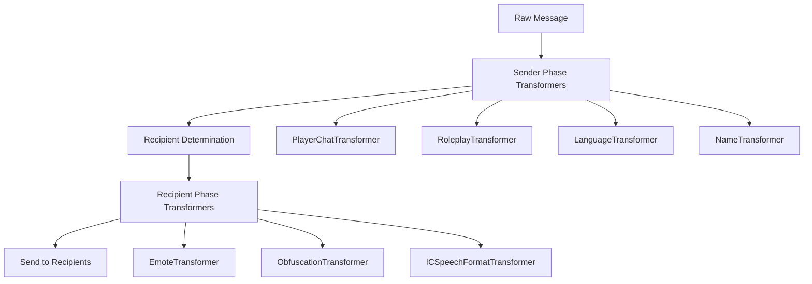

# System Patterns: The BASICs Architecture

## Overall Architecture

### Modular System Design
The mod uses a **modular subsystem pattern** where each major feature is implemented as an independent system that can be enabled/disabled:

```
BaseBasicModSystem (Abstract)
├── RPProximityChatSystem (Main orchestrator)
├── LanguageSystem (Language management)
├── PlayerStatSystem (Statistics tracking)
├── TpaSystem (Teleportation)
├── SaveNotificationsSystem (Server notifications)
├── SleepNotifierSystem (Sleep coordination)
└── RepairModSystem (Admin tools)
```

### Message Processing Pipeline
**Transformer Pattern** for chat message processing with two distinct phases:



## Key Design Patterns

### 1. Extension Methods Pattern
Player data is managed through extension methods on `IServerPlayer`:
```csharp
public static class IServerPlayerExtensions
{
    public static string GetNickname(this IServerPlayer player)
    public static void SetChatMode(this IServerPlayer player, ProximityChatMode mode)
    public static bool KnowsLanguage(this IServerPlayer player, Language lang)
}
```

### 2. Configuration-Driven Behavior
All features are controlled by a comprehensive `ModConfig` class with protobuf serialization:
```csharp
[ProtoContract]
public class ModConfig
{
    [ProtoMember(1)] public IDictionary<ProximityChatMode, int> ProximityChatModeDistances
    [ProtoMember(2)] public bool DisableNicknames
    [ProtoMember(3)] public IList<Language> Languages
}
```

### 3. Message Context Pattern
Chat processing uses a context object that flows through transformers:
```csharp
public class MessageContext
{
    public string Message { get; set; }
    public IServerPlayer SendingPlayer { get; set; }
    public Dictionary<string, object> Metadata { get; set; }
    public Dictionary<string, bool> Flags { get; set; }
    public List<IServerPlayer> Recipients { get; set; }
}
```

### 4. Network Synchronization Pattern
Client-server config synchronization using protobuf messages with connection safety:
```csharp
[ProtoContract]
public class TheBasicsConfigMessage
{
    [ProtoMember(1)] public int ProximityGroupId;
    [ProtoMember(2)] public ModConfig Config;
    [ProtoMember(3)] public int? LastSelectedGroupId;
}

// Safe packet sending pattern
if (_clientConfigChannel != null && _clientConfigChannel.Connected)
{
    _clientConfigChannel.SendPacket(new TheBasicsClientReadyMessage());
}
else
{
    // Queue for later or handle gracefully
    QueueConfigAction(() => SendPacketWhenReady());
}
```

## Component Relationships

### Core Dependencies
```
RPProximityChatSystem
├── LanguageSystem (language processing)
├── DistanceObfuscationSystem (message obfuscation)
├── ProximityCheckUtils (line of sight)
└── TransformerSystem (message pipeline)
```

### Data Flow Architecture
1. **Player Input** → Chat command or proximity chat message
2. **Message Context Creation** → Wrap in context object with metadata
3. **Sender Phase Processing** → Validate, determine recipients, format
4. **Recipient Phase Processing** → Per-recipient transformations (language, distance)
5. **Network Transmission** → Send to determined recipients

### Client-Side Integration
- **Harmony Patches** for chat UI modifications
- **Network Channels** for config synchronization
- **Event Hooks** for player join/leave handling

## Critical Implementation Paths

### Message Processing Flow
1. `Event_PlayerChat` captures raw chat input
2. `MessageContext` created with player and message data
3. `TransformerSystem.ProcessMessagePipeline()` orchestrates processing
4. **Sender Phase**: Validation, language detection, recipient determination
5. **Recipient Phase**: Per-recipient language processing, distance obfuscation
6. Final message delivery via `player.SendMessage()`

### Language System Flow
1. Player speaks with language prefix (`:tr Hello`)
2. `ChangeSpeakingLanguageTransformer` detects and validates language
3. `LanguageTransformer` scrambles message for non-speakers
4. `LanguageScrambler.ScrambleMessage()` generates syllable-based gibberish

### Distance-Based Features
1. `RecipientDeterminationTransformer` calculates proximity
2. `ObfuscationTransformer` applies distance-based character replacement
3. `DistanceObfuscationSystem.GetFontSize()` adjusts text size by distance

## Error Handling Patterns

### Graceful Degradation
- Missing config values fall back to defaults via `InitializeDefaultsIfNeeded()`
- Invalid language references default to "Babble" language
- Network failures queue actions until connection restored
- Disconnected channels defer packet sending via `QueueConfigAction()`

### Network Connection Safety
- **Always check `channel.Connected` before sending packets**
- Use existing `QueueConfigAction()` mechanism for deferred operations
- Log connection status for debugging network timing issues
- Graceful handling when channels are not yet established

### Validation Strategy
- Command argument parsing with clear error messages
- Language validation before allowing speech
- Nickname requirements enforced before roleplay chat
- Network channel connection validation before packet transmission

## Performance Considerations

### Efficient Recipient Calculation
- Manhattan distance for initial proximity filtering
- Line-of-sight checks only for sign language
- Cached player position data for movement tracking

### Memory Management
- Protobuf serialization for network efficiency
- Extension methods avoid object creation overhead
- Transformer reuse in pipeline processing